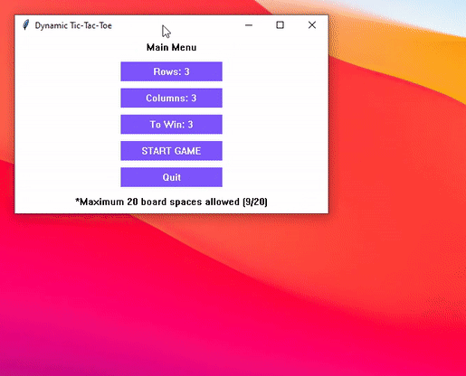

# Dynamic-Tic-Tac-Toe
Tic-tac-toe game in which the computer plays the user and either draws or wins. The user decides how many columns, rows, and how many in a row to win, though processing is limited to a board with 20 spaces. Implements lexicographic permutation for computer decisions.

Supported on both Windows and MacOS. Note that this was built before I properly learnt to design software using OOP, so the implementation may look a bit odd.

**Short Demo (Longer Demo in Repository):**

 

